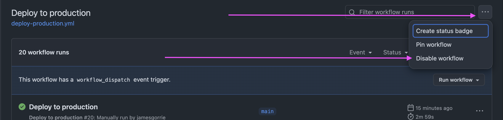

# Navigator Frontend

A modern, theme-capable frontend application for the Climate Policy Radar Navigator
platform. This repository contains the code necessary to build and deploy the
`navigator-frontend` container.

## 🚀 Quick Start

It is recommended you run the app in a docker container but you can also run the
app outside a container.

### Docker

```bash
make run_dev
```

### Not using Docker

```bash
# Install dependencies
npm install

# Set up environment
cp .env.example .env

# Ensure you have a valid tsconfig.json
cp tsconfig.base.json tsconfig.json

# Run development server (using the theme from .env)
npm run dev
```

## 📋 Prerequisites

- Node.js (v24 or higher)
- Docker
- Make
- [Trunk.io](https://trunk.io) for code quality

First-time setup:

```bash
make install_trunk  # Only if trunk.io not already installed
```

### Environment Configuration

Configuration is managed through environment variables. See `.env.example` for all
available options.

The project will not contain a `tsconfig.json` - this file is generated by docker
depending on the theme selected. You can optionally create one yourself if you
prefer to run the application outside of docker. Copy and rename the existing
`tsconfig.base.json` to `tsconfig.json`

⚠️ **Important**: if you need to make persistent changes to the `tsconfig`,
remember to edit and commit these changes to the `tsconfig.base.json` file.

## 🧪 Testing

This project uses:

- Vitest for unit testing
- Playwright for E2E testing
- Act for GitHub workflows debugging/testing (click here for [our act scripts](.github/workflows/scripts/))

Run tests:

```bash
# Typecheck
npm run tsc

# Unit tests
npm run test

# E2E tests
npm run test-e2e

# E2E tests with playwright UI (you will need to install playwright locally - follow instructions when running the below command)
npm run test-e2e-ui
```

## 🌐 Simulating prod

To run the app in a docker instance in 'production mode':

```base
make run
```

Please note: this will not track local updates to the code, so it is not
recommended to run the app in this way for local development. Please read
the 'Quick Start' above.

## 🏭 Deployment

- Go to the [Deploy all to production](https://github.com/climatepolicyradar/navigator-frontend/actions/workflows/deploy-all-production.yml)
  GitHub action OR 👇
- Go to the [Deploy to production](https://github.com/climatepolicyradar/navigator-frontend/actions/workflows/deploy-production.yml)
  GitHub action
- You can only deploy from from `main`
- Select the app you want to deploy
- "Run workflow"

This builds and pushes to the ECR `latest` tag which then
[automatically triggers a deploy](https://docs.aws.amazon.com/apprunner/latest/dg/manage-deploy.html).

### 🔔 I've merged a buggy commit into `main`

No worries. Just disable the deployment actions above and let people know in the
`#application` and `#engineering` Slack channels.



### 🔙 Rollback

- To rollback find [the merge commit](https://github.com/climatepolicyradar/navigator-frontend/commits/main/)
  which will have a corresponding ECR container built
- use the navigator-infra [Deploy frontend GitHub action](https://github.com/climatepolicyradar/navigator-infra/actions/workflows/deploy-frontend.yml)
  to deploy the SHA

## 🎨 Theming

Themes are configured in `themes/[theme-name]/config.ts`. Each theme can override:

- Styling
- Feature flags
- Environment-specific configurations

## 🏴‍☠️ Features

There are three different methods used in the app to control which feature set\
a given user sees. These work in tandem and are designed to overlap, which is\
possible by using the same key for multiple types.

| Method:                   | A/B test                                                               | Feature flag                                                              | Theme feature                                                      |
| ------------------------- | ---------------------------------------------------------------------- | ------------------------------------------------------------------------- | ------------------------------------------------------------------ |
| Use:                      | Rolling an experimental feature out to a proportion of users.          | Previewing an upcoming feature or developing a new feature in production. | Making features available on a per-app basis, typically long term. |
| Configured at:            | PostHog feature flag with % rollout                                    | PostHog feature flag with 0% rollout + PostHog early access feature       | `/themes/<THEME>/config.ts` `features` object                      |
| Add key to:               | `/src/types/features.ts` `abTestKeys`                                  | `/src/types/features.ts` `featureFlagKeys`                                | `/src/types/features.ts` `configFeatureKeys`                       |
| Manually enable via:      | `/_feature-flags` only if also added as a PostHog early access feature | `/_feature-flags`                                                         | Theme config file (above)                                          |
| Can be on by default:     | Yes                                                                    | No                                                                        | Yes                                                                |
| Client-side only:         | Yes                                                                    | No                                                                        | No                                                                 |
| Get value via:            | `getFeaturesWithABTests()`                                             | `getFeatures()`                                                           | `getFeatures()`                                                    |
| Persist client-side with: | `FeaturesContext`                                                      | `FeaturesContext`                                                         | `FeaturesContext`                                                  |

An example of intentionally overlapping keys:

`knowledgeGraph` was a key used both as a feature flag and as a theme feature\
(added to both key arrays). When one was on, the feature was on, so it could be\
on for all users on specific apps using the theme feature, and on other apps\
turned on manually through the feature flags page to preview it.

## 📜 License

This project is licensed under the terms specified in [LICENSE.md](LICENSE.md).
